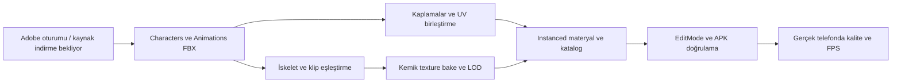

# Mixamo — kaynak ve görsel entegrasyon durumu

2026-09-19. Bu belge indirilmiş içerik ile hedeflenen içeriği ayırır. Milestone tamamlanma raporu değildir.

## Envanter

| İçerik | Hedef | İndirilen/doğrulanan |
|---|---|---|
| Walker | 3–4 iş kıyafetli/yırtık gerçekçi karakter | 8 gövde indirildi; rol eşleştirmesi bake öncesi yapılacak |
| Runner | 1 ince yapılı karakter; Walker yeniden kullanılabilir | Parasite / Zombiegirl adayları; kesin rol bake öncesi |
| Tank | Mutant | `Mutant.fbx` indirildi |
| Spitter | 1 deforme karakter | `Parasite_L_Starkie.fbx` indirildi |
| Exploder | Uygun şişman/tulumlu karakter varsa | `Romero.fbx` / `Survivor_A_Lusth.fbx` adayları; doğrulama bekliyor |
| Zombi animasyonları | Idle, Walk, Run, Attack, Hit, Crawl, Death | 11 FBX indirildi; iki walk ve iki death varyantı dahil |
| Mutant animasyonları | Walking, Punch, Dying | 7 FBX indirildi: Idle, Walk, Run, Punch, Swipe, Roar, Death |

Etkileşimli Chromium + Playwright oturumuyla Mixamo hesabına giriş yapıldı. `zombie` aramasıyla zombi animasyonları; karakter kataloğunda mutant ve farklı zombi gövdeleri indirildi. Animasyon indirmelerinde FBX for Unity, Without Skin, 30 FPS ve keyframe reduction none kullanıldı. Bir adet sıfır baytlı başarısız indirme ayıklandı. Hesap parolası veya oturum çerezi projeye kaydedilmez.

Güncelleme (2026-09-19): Playwright 1.63.0 geçici ve yalıtılmış Python ortamına kuruldu. İndirilen Chromium Ubuntu sandbox kısıtına takıldığı için sistemdeki Chromium 153.0.8010.36, sandbox açık bırakılarak Playwright ile çalıştırıldı. Mixamo girişi, arama, indirme ayarları ve proje klasörüne kaydetme doğrulandı. Kurulum `/tmp/lastground-browser-4FbEOP` altında; geçici dizin temizlenirse yeniden kurulum gerekir.

Resmî kaynak: [Adobe Mixamo FAQ](https://helpx.adobe.com/creative-cloud/faq/mixamo-faq.html). Adobe ID ile kullanılabilir. Varlıklar henüz edinilmediği için `ASSET_SOURCES.md` içine indirilmiş Mixamo asset kaydı eklenmedi.

## Gerçek entegrasyon hattı

| Kontrol | İncelenen mevcut durum | Sonraki gerekli iş |
|---|---|---|
| Gövdeler | `CrowdBodySource`: dört Quaternius FBX; Mixamo klasöründe 7 gövde | Gerçek indirilen dosyalara rol/gövde eşleştirmesi |
| Animasyon | `CrowdBaker.LoadClips`: yalnızca `ModelPath` içindeki klipler | Ayrı Without Skin klipleri ve hedef iskelete güvenilir retarget/örnekleme |
| Materyal | `CrowdCatalogBuilder`: tek Quaternius atlası | Mixamo kaplamalarını koruyan UV/atlas veya uygun materyal düzeni |
| Shader | `LG/CrowdInstanced`: base map, ana ışık, ambient, rim ve ışık grid'i | Gerçek kaplamalarla görünüm kontrolü; normal/roughness gibi özellikler mevcutmuş kabul edilmez |
| LOD | Bake hedefleri 1900 / 800 / 300 vertex | Gerçek gövdelerde yüz/silüet, deformasyon ve geometri kontrolü |
| Performans | Mixamo import/bake bu turda çalıştırılmadı | OnePlus 5T / Redmi Pad Pro cihazlarında yeniden ölçüm |

## Görsel hedef

İnsan oranları, doğal yüz farklılıkları, kirli/yıpranmış kumaş, sade okunaklı silüetler. Konseptler hedef yönü gösterir; aşağıdakiler Mixamo modeli veya oyun ekran görüntüsü değildir:

Akıcı hareket, zeminde kaymayan ayaklar, okunaklı saldırı hazırlığı ve düzgün hit/death geçişleri kalite kabulünün parçasıdır. Geliştirme değerleri/fun değerlendirmesi ayrı oynanış testini gerektirir. Konsept kalitesi tek başına cihazdaki görsel kalite veya eğlence kanıtı değildir.

## Bu çalışmada tamamlanan

Kaynak klasörleri, README'ler ve Unity metadata oluşturuldu. 8 karakter FBX'i, kaplama klasörleri ve 18 animasyon FBX'i proje yollarına indirildi. Runtime katalog ve `CrowdBodySource` henüz Mixamo'ya çevrilmedi; mevcut bake sistemi ayrı `Without Skin` kliplerini otomatik tüketmediği için entegrasyon işi açık. Yeni APK, Unity bake, compile/test/profile bu turda çalıştırılmadı.
